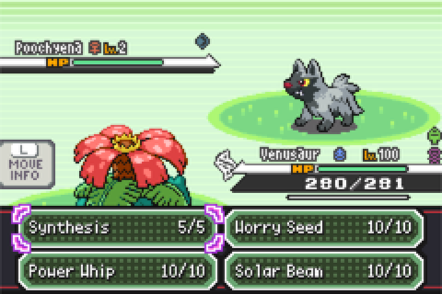

# `pokeemerald-expansion` Features
# Gen 5 Black/White Battle UI

This branch replaces the battle interface with the one
from Pokémon Black and White. It contains the battle UI and nothing else, so it can be
merged into an existing project on its own. Battle backgrounds are left alone.

| | |
| --- | --- |
|  |  |

## Configuration

Everything lives in `include/config/bw_battle_ui.h`:

| Setting | Default | What it does |
| --- | --- | --- |
| `BW_BATTLE_UI` | `TRUE` | Master switch for everything below. |
| `BW_BATTLE_UI_TEXTBOX` | `TRUE` | The BW message box. |
| `BW_BATTLE_UI_INPUTBOX` | `TRUE` | The action box, move box and cursor. Requires the textbox. |

Turning the textbox off returns the lower half of the screen to the Gen 3 look. Turning
off only the input box keeps the BW message box but restores the Gen 3 menus. The
healthboxes and type icons are a separate port and are **not** switched off by any of
these, so the top half stays BW either way.

Type icons are controlled by expansion's own `B_SHOW_TYPES` in `include/config/battle.h`,
which this branch sets to `SHOW_TYPES_ALWAYS`.

One requirement to be aware of: `B_MOVE_REARRANGEMENT_IN_BATTLE` must be `GEN_4` or later,
which is the expansion default. The BW move box has nowhere to show the Gen 3 move
swapping prompt, so a lower setting stops the build with an explanatory error rather than
producing a broken menu.

## Credits

Almost none of this is my own work. It is a port, and it exists because of:

- **[EternalCode](https://github.com/PlatinumMaster/EternalCode-BWHealthBars-BPRE)** for the
  original Black/White health bar design, graphics and FireRed implementation.
- **[PlatinumMaster](https://github.com/PlatinumMaster)** for maintaining a buildable
  source of that health bar implementation.
- **[NicoSwag](https://github.com/NicoSwag/pokeemerald-expansion/tree/nicos_cool_ui)** for
  the Nico's Cool UI battle type-icon artwork and layout.
- **[mudskipper13](https://github.com/mudskipper13/pokeemerald/tree/feature/bwBattleUI)** for
  the Black/White message box, action box, move box and cursor, and the outlined battle
  UI font.

If you use this branch, please credit myself and all of the above.

---

# About `pokeemerald-expansion`

<<<<<<< HEAD
## DS Party Screen (Expansion)
This feature branch is a port of the DS party screen patch for Fire Red / Emerald.

The DS party screen functionality comes from TheXaman: https://github.com/TheXaman/pokeemerald/tree/tx_ui_party_screen_ds_style_2

<<<<<<< HEAD
While the graphics & other touch ups come from the patches themselves: https://www.pokecommunity.com/threads/fr-em-pok%C3%A9mon-party-screen-modifications-base-hgss-and-bw-styles.414022/

Huge credits to everyone involved!
**`pokeemerald-expansion`** is a GBA ROM hack base that equips developers with a comprehensive toolkit for creating Pokémon ROM hacks. **`pokeemerald-expansion`** is built on top of [pret's `pokeemerald`](https://github.com/pret/pokeemerald) decompilation project. **It is not a playable Pokémon game on its own.**

# [Features](FEATURES.md)

**`pokeemerald-expansion`** offers hundreds of features from various [core series Pokémon games](https://bulbapedia.bulbagarden.net/wiki/Core_series), along with popular quality-of-life enhancements designed to streamline development and improve the player experience. A full list of those features can be found in [`FEATURES.md`](FEATURES.md).

# [Credits](CREDITS.md)

 [](CREDITS.md)

If you use **`pokeemerald-expansion`**, please credit **RHH (Rom Hacking Hideout)**. Optionally, include the version number for clarity.

```
Based off RHH's pokeemerald-expansion 1.16.3 https://github.com/rh-hideout/pokeemerald-expansion/
```
=======
Based off RHH's pokeemerald-expansion 1.15.0 https://github.com/rh-hideout/pokeemerald-expansion/
>>>>>>> 6084f2c397cd06fe640d9de1cfbec7e0b8954af2

A collection of feature branches to implement flexible systems to the [pokeemerald-expansion codebase](https://github.com/rh-hideout/pokeemerald-expansion).

Please visit [the wiki](https://github.com/fisham-org/pokeemerald-expansion-features/wiki) for detailed descriptions, videos & implementation details for the feature branches within this repo.

> Note: In addition to hand-writing it, AI has been used to generate documentation & code used for these features.
